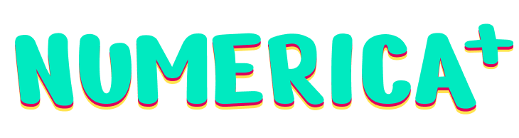

# coffeerica-twitch

## Game Description
Does your chat know how to count? but how fast?

Cofferica is a mini-game based on Numerica for NumericaJam

- Each time a viewer types a number, the counter will increase. 
- If a viewer types the wrong number, the counter will restart, and the viewer gets an optional but well-deserved timeout.
- You have some time to type the correct number. If the counter reach 0 the last player will be timeouted. Be a good friend.
- A randome number between 3 and 10 viewers can't type consecutive numbers.

Good luck!

## Download the game
The game is available for free on itch.io ->
[https://ildesir.itch.io/coffeerica](https://ildesir.itch.io/coffeerica)
- Available platforms
    - Windows

## Thanks
This game has been developed thanks to a RothioTome and her comunity. This wouldn't be possible without all of you <3

Numerica is available for free on itch.io ->
[https://rothiotome.itch.io/numerica](https://rothiotome.itch.io/numerica)

## License
This project is released under the GPLv3 License by RothioTome (2023)